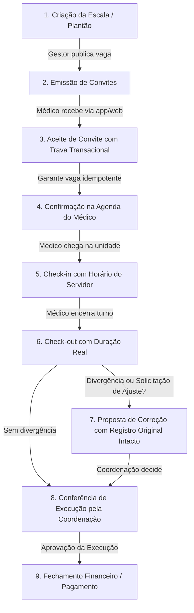

# Matriz de Status Real Pós-Autenticação — PlantãoPro

> **Data de Auditoria:** 21/09/2026  
> **Branch:** `feat/cliente-generico-ciclo-operacional-alertas`  
> **Suíte de Testes:** 498/498 testes aprovados (100%)  
> **Padrões de Isolamento:** Multi-tenant estrito por `tenant_id` / `cliente_id` com Dapper + PostgreSQL e BCrypt.

---

## 1. Visão Geral da Arquitetura de Acesso e Isolamento

O PlantãoPro opera sob isolamento estrito multi-tenant. Cada cliente contratante possui uma conta com identificadores canônicos (`tenants`, `clientes`, `unidades`, `hospitais`).

### 1.1 Premissas Inegociáveis Validadas
1. **Neutralidade de Marca:** A "Santa Casa Demonstração" existe exclusivamente como laboratório de testes em ambiente de desenvolvimento (`DemoSeed:Enabled = true`). Nenhuma tela, componente, regra ou consulta de produção referencia o nome ou perfil de laboratório. A interface emprega termos neutros ("Sua unidade", "Seu dia", "Clientes da plataforma", "Organização selecionada").
2. **Perfis Canônicos:** Alinhamento integral com `RolesConstants` na API e Web:
   - Plataforma: `ADMINISTRADOR_GLOBAL`, `SUPORTE`, `AUDITOR`.
   - Gestão do Cliente: `ADMINISTRADOR_CLIENTE`, `ADMINISTRADOR`, `DIRETOR`, `COORDENACAO`, `OPERADOR`, `HOSPITAL`, `FINANCEIRO`.
   - Assistencial / Execução: `MEDICO`.
3. **Sessão e Autenticação:** Sessão com hash BCrypt persistida em `plantaopro.auth_sessoes`. Suporte a endpoint `POST api/auth/refresh-context` e ação Web `Account/RefreshContext` para revalidação imediata de permissões e módulos sem desconectar o usuário.
4. **Modais Acessíveis para Ações Irreversíveis:** Nenhuma chamada nativa `window.alert()` ou `window.confirm()` é permitida. Todas as ações destrutivas ou de alta criticidade usam `data-confirm="true"` com modal acessível WAI-ARIA (`#pp-confirm-modal`) e feedback via `window.PlantaoProToast`.

---

## 2. Matriz Funcional Real vs. Casco por Persona

### Persona A: Administrador Global (`ADMINISTRADOR_GLOBAL`)

| Rota / Tela | Função | Status Real | Casco Remanescente | Ações Reais & Controles |
|---|---|---|---|---|
| `/Clientes` / `/Clientes/Index` | Central Global de Clientes | **100% Funcional** | Nenhum | Paginação no PostgreSQL, busca por CNPJ/razão social, suspensão/reativação com motivo obrigatório e auditoria em transação. |
| `/Clientes/Details/{id}` | Visão 360 do Cliente | **100% Funcional** | Nenhum | Abas reais (Visão geral, Unidades, Módulos, Equipe, Histórico). |
| `/Onboarding/NovoCliente` | Provisionamento de Cliente Genérico | **100% Funcional** | Nenhum | Cria `tenant`, `cliente`, `unidade`, `hospital`, `assinatura`, módulos operacionais iniciais (`ESCALAS`, `EXECUCAO`, `CONFERENCIA`), usuário admin com BCrypt e dispara alertas. |
| `/Modulos/Catalogo` / `Tenant/{id}` | Catálogo Modular e Ativação | **100% Funcional** | Nenhum | Verificação de dependências em C# 10, cálculo de vigência e ativação de módulos contratuais. |
| `/Auditoria` | Trilha de Auditoria Global | **100% Funcional** | Nenhum | Log imutável de eventos administrativos e operacionais. |
| `/MinhaCentral` | Central Operacional Global | **100% Funcional** | Nenhum | Detecta contexto sem tenant e renderiza atalhos globais de governança com `GlobalView = true`, impedindo visualização de escalas internas como se fossem globais. |

---

### Persona B: Gestor / Coordenador do Cliente (`ADMINISTRADOR_CLIENTE`, `ADMINISTRADOR`, `COORDENACAO`)

| Rota / Tela | Função | Status Real | Casco Remanescente | Ações Reais & Controles |
|---|---|---|---|---|
| `/Escalas` / `/Escalas/Index` | Grade Operacional de Plantões | **100% Funcional** | Nenhum | Filtragem obrigatória por `tenant_id` e `unidade_id`. Criação de escalas, publicação de vagas e emissão de convites transacionais. |
| `/Escalas/Details/{id}` | Detalhes e Gestão de Vagas | **100% Funcional** | Nenhum | Cancelamento de escala com `data-confirm="true"` acessível, convite individual e seleção de médicos habilitados. |
| `/ConferenciaExecucao` | Central de Conferência de Execução | **100% Funcional** | Nenhum | Comparação de todas as origens temporais (previsto, registrado, proposto e aprovado). Aprovação e recusa de ajustes com bloqueio de auto-aprovação pelo médico solicitante. Modais de confirmação com justificativa obrigatória. |
| `/Financeiro` / `/Financeiro/Index` | Fechamento Financeiro | **100% Funcional** | Nenhum | Validação de obrigações aprovadas, conciliação e histórico auditado. |
| `/Financeiro/Details/{id}` | Detalhe do Pagamento | **100% Funcional** | Nenhum | Liquidação manual com formulário tipado, contestação com valor previsto auditado e `data-confirm="true"`. |
| `/CommandCenter` | Centro de Comando Operacional | **100% Funcional** | Nenhum | Banner contextual `.pp-alert-banner` alimentado pelo `IAlertRuleService` (escalas sem cobertura em 48h, check-ins atrasados >15m). Alertas em tempo real via SignalR `/hubs/notificacoes`. |

---

### Persona C: Plantonista / Profissional Médico (`MEDICO`)

| Rota / Tela | Função | Status Real | Casco Remanescente | Ações Reais & Controles |
|---|---|---|---|---|
| `/MeuDia` | Visão Operacional Diária | **100% Funcional** | Nenhum | Banner de alerta para check-in pendente imediato, atalhos reais para MinhaAgenda/Presencas e MeusPagamentos. Toast informativo em caso de plantão ativo. |
| `/MinhaAgenda` | Agenda de Plantões do Médico | **100% Funcional** | Nenhum | Isolamento estrito por `medico_id` (médico nunca acessa plantões alheios nem rotas de gestão). |
| `/MinhaAgenda/Presencas` | Registro de Entrada/Saída e Ajustes | **100% Funcional** | Nenhum | Check-in e check-out gravando timestamp UTC do servidor (`checkin_recebido_em`) com detecção de fuso horário do navegador. Solicitação e cancelamento de proposta de correção com `data-confirm="true"` e preservação do dado bruto. |
| `/MinhaAgenda/MeusPagamentos` | Produção e Liquidação | **100% Funcional** | Nenhum | Rastreabilidade de valores brutos, previstos e liquidados com proteção contra visibilidade de terceiros. |

---

## 3. Ciclo Operacional Completo de Ponta a Ponta

### 3.1 Garantias de Concorrência e Idempotência
1. **Aceite de Convite:** Executado com `pg_advisory_xact_lock` no PostgreSQL e verificação `expira_em is null or expira_em > now()`, impedindo que múltiplos médicos ocupem a mesma vaga simultaneamente.
2. **Presença:** Gravada com trava `for update` e unicidade `on conflict(tenant_id, escala_id) do nothing`.
3. **Conferência:** Validação de versão atômica (`versao = request.Versao`) impedindo corrida de decisão ou sobrescrita concorrente.

---

## 4. Motor de Regras de Alerta (`IAlertRuleService`)

O serviço `AlertRuleService` monitora o ciclo de vida e dispara alertas tanto para renderização estática quanto para push em tempo real via `IOperationRealtimePublisher` (SignalR `/hubs/notificacoes`):

1. **`ESCALA_SEM_COBERTURA` (Nível: Crítico):** Plantões com início nas próximas 48 horas sem médico confirmado.
2. **`CHECKIN_PENDENTE` (Nível: Atenção / Crítico):** Plantões iniciados há mais de 15 minutos cujo médico ainda não registrou entrada.
3. **`CONVITE_PENDENTE` (Nível: Informativo):** Convites emitidos aguardando resposta do profissional.
4. **`OCORRENCIA_ABERTA` (Nível: Atenção):** Ocorrências operacionais sem resolução.
5. **`FECHAMENTO_FINANCEIRO_PENDENTE` (Nível: Informativo):** Plantões com check-out realizado pendentes de conferência da coordenação.
6. **`PLATAFORMA_CLIENTES_SUSPENSOS` / `PLATAFORMA_CLIENTES_SEM_MODULOS` (Superadmin):** Monitoramento de saúde comercial e módulos sem expor plantões operacionais ao superadmin.

---

## 5. Resumo da Conformidade da Interface
- **Zero alerts nativos:** 0 ocorrências de `window.alert()` ou `confirm()`.
- **Zero links falsos:** 0 ocorrências de `href="#"`.
- **Zero páginas Razor com `@page` solto:** 0 Razor Pages fora do padrão MVC arquitetural.
- **Suíte de Testes:** 498 testes executados com 100% de aprovação.
